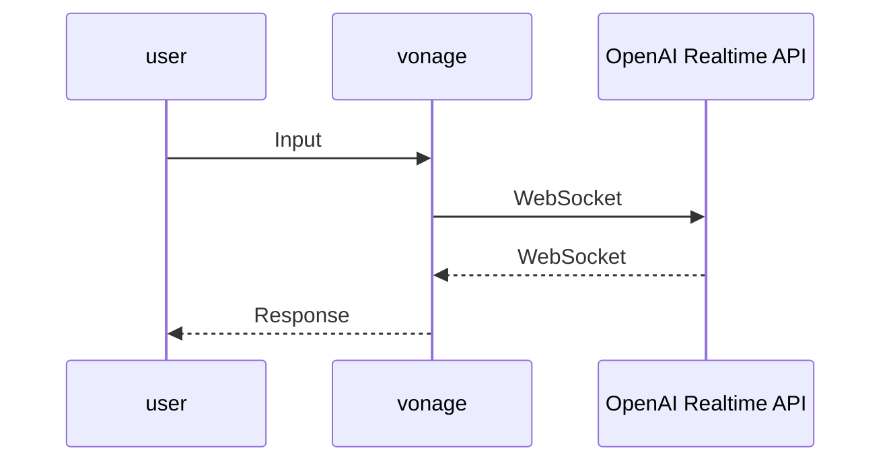

# Vonage と OpenAI Realtime API の WebSocket 連携

## 概要

ユーザが発声した内容を OpenAI Realtime API が回答を返します。



## 設定

### Vonage でアカウントを開設

[Vonageアカウントの作成](https://zenn.dev/kwcplus/articles/create-vonage-account)

### Vonage で電話番号を取得

[Vonageで電話番号を取得する方法](https://zenn.dev/kwcplus/articles/buynumber-vonage)

### Vonage でアプリケーションを作成
  
1. [Vonage Voice API ガイド](https://zenn.dev/kwcplus/articles/vonage-voice-guide)
1. 作成したアプリケーションに購入した電話番号をリンク

### OpenAI の API キー取得

<https://platform.openai.com/docs/quickstart>

### セットアップ

```sh
npm install
npm run start
ngrok http 3000
```

起動した際に払い出される ngrok の URL をコピーする。

```sh
cp .env.example .env
```

`.env`を設定する。
`.env`を読み込むために npm run start を Ctrl-c で終了させ、再度 npm run start で起動。

ngrok を起動するたびに払い出される URL が異なるため、ngrok を再起動した場合は上記手順を繰り返す。

Vonage のダッシュボードから、作成したアプリケーションの設定画面を開き、**回答 URL** に ``ngrok の URL/incoming-call`` を設定、メソッドは`POST`。
同じく、**イベント URL** に ``ngrok の URL/event`` を設定、メソッドは`POST`。

### 実行

アプリケーションにリンクした電話番号に電話をして、AIによる回答が戻って来ることを確認する。
