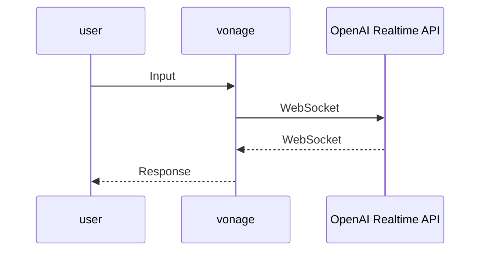

# Vonage と OpenAI Realtime API の WebSocket 連携

## 概要

ユーザが発声した内容を OpenAI Realtime API が回答を返します。



## 設定

### Vonage でアカウントを開設

[Vonageアカウントの作成](https://zenn.dev/kwcplus/articles/create-vonage-account)

### Vonage で電話番号を取得

[Vonageで電話番号を取得する方法](https://zenn.dev/kwcplus/articles/buynumber-vonage)

### Vonage でアプリケーションを作成
  
1. [Vonage Voice API ガイド](https://zenn.dev/kwcplus/articles/vonage-voice-guide)
1. 公開鍵と秘密鍵を生成し、秘密鍵をprivate.keyという名前に変更してディレクトリの直下に配置。
1. 作成したアプリケーションに購入した電話番号をリンク

### OpenAI の API キー取得

<https://platform.openai.com/docs/quickstart>

### セットアップ

```sh
npm install
npm run start
ngrok http 3000
```

起動した際に払い出される ngrok の URL をコピーする。

```sh
cp .env.example .env
```

`.env`を設定する。

キー|値
:--|:--
SERVER_URL|ngrokで払い出されたURL（`https://`は除く）
OPENAI_API_KEY|OpeAIのシークレットキー（sk-から始まる文字列）
OPENAI_API_VERSION|2025-04-01-preview（OpenAI Realtime API の最新バージョン）
OPENAI_MODEL|gpt-realtime（Realtime 対応のモデル）
VONAGE_PRIVATE_KEY_PATH|Vonage Voice API v2 用の秘密鍵ファイルパス（例: `./private.key`）
VONAGE_OUTBOUND_FROM|Vonageで取得した発信元電話番号（E.164形式）

上記の設定では、OpenAI Realtime API 側に `OPENAI_API_VERSION=2025-04-01-preview` を送り、`gpt-realtime` モデルと組み合わせることで最新仕様に対応しています。これにより音声入力→応答のリアルタイムループが安定して機能します。

追加の調整をしたいときは、ルートにある `system-message.txt` に書かれた文言が最優先で読み込まれます。ファイルが存在しないか空の場合はデフォルトの挨拶文（README の冒頭にあるチャッピーの定義）を使用します。

`.env`を読み込むために npm run start を Ctrl-c で終了させ、再度 npm run start で起動。

ngrok を起動するたびに払い出される URL が異なるため、ngrok を再起動した場合は上記手順を繰り返す。

Vonage のダッシュボードから、作成したアプリケーションの設定画面を開き、**回答 URL** に ``ngrok の URL/incoming-call`` を設定、メソッドは`POST`。
同じく、**イベント URL** に ``ngrok の URL/event`` を設定、メソッドは`POST`。

### `/connect` でのアウトバウンド発信

Vonage Voice API v2 を使って任意の番号へ発信するには、以下のように `POST /connect` を呼び出します。呼び出し時に `VONAGE_APPLICATION_ID` と `VONAGE_PRIVATE_KEY_PATH` から生成した JWT を内部で利用し、相手が応答すると `/answer` の NCCO（ガイダンス → WebSocket 接続）を通じて OpenAI Realtime に接続します。

```sh
curl -X POST https://<サーバー>/connect \
  -H "Content-Type: application/json" \
  -H "X-API-Key: ${VONAGE_APPLICATION_ID}" \
  -d '{
    "to": "+818012345678",
    "from": "+815031023332"
  }'
```

`from` を省略すると `VONAGE_OUTBOUND_FROM` の値が自動で利用されます。秘密鍵ファイル（例: `private.key`）は `.gitignore` されているので、ローカル/本番それぞれの環境に配置してください。

`/connect` では `X-API-Key` ヘッダーを必須とし、値が `VONAGE_APPLICATION_ID` と一致しないリクエストは拒否します。バックエンドと連携するクライアントでは、このヘッダーを常に付与してください。

### テスト

ngrokが起動しアプリケーションも起動していることを確認したら、アプリケーションにリンクした電話番号に電話をして、AIによる回答が戻って来ることを確認する。

## Fly.io 環境のセットアップ

Fly.io 環境を使って、アプリケーションをデプロイすることができます。

### Fly.io CLIのインストール

```sh
brew install flyctl
```

### 初期セットアップ（一度だけ）

まずは本番用の環境変数を作成します。

```sh
cp .env .env.production
```

次に、アプリケーションのデプロイ環境を作成します。

```sh
fly launch
```

これでDocker環境を自動的に生成してくれます。
サーバーのURL（XXXXXXXX.fly.dev）が払い出しされるので、`.env.production`の`SERVER_URL`を更新します。

### 環境変数の指定

以下のコマンドで、`.env.production`の内容をFly.ioの環境変数に設定できます。

```sh
fly secrets import < .env.production
```

個別に環境変数を設定する場合は、以下のように設定することもできます。

```sh
fly secrets set NAME=VALUE
```

環境変数を変更したら、デプロイをし直してください。

### デプロイ

以下のコマンドでデプロイができます。

```sh
npm run deploy
```

## ローカル実行とサーバー実行

`change-url.js`でVonageのアプリケーション環境を書き換えることができるので、以下のコマンドを使うと実行環境を切り替えながらテストができます。

ローカル実行

```sh
npm run debug
```

サーバー実行

```sh
npm run deploy
```
