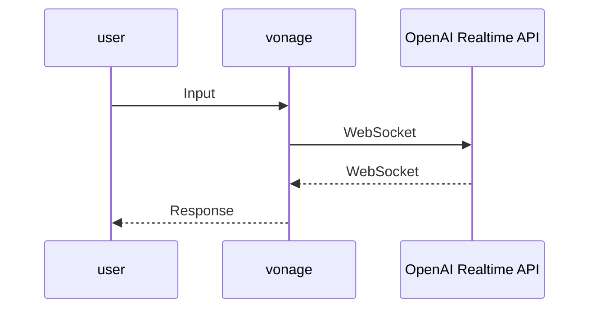

# Vonage と OpenAI Realtime API の WebSocket 連携

## 概要

ユーザが発声した内容を OpenAI Realtime API が回答を返します。



## 設定

### Vonage でアカウントを開設

[Vonageアカウントの作成](https://zenn.dev/kwcplus/articles/create-vonage-account)

### Vonage で電話番号を取得

[Vonageで電話番号を取得する方法](https://zenn.dev/kwcplus/articles/buynumber-vonage)

### Vonage でアプリケーションを作成
  
1. [Vonage Voice API ガイド](https://zenn.dev/kwcplus/articles/vonage-voice-guide)
1. 作成したアプリケーションに購入した電話番号をリンク

### OpenAI の API キー取得

<https://platform.openai.com/docs/quickstart>

### セットアップ

```sh
npm install
npm run start
ngrok http 3000
```

起動した際に払い出される ngrok の URL をコピーする。

```sh
cp .env.example .env
```

`.env`を設定する。

キー|値
:--|:--
SERVER_URL|ngrokで払い出されたURL（https://は除く）
OPENAI_API_KEY|OpeAIのシークレットキー（sk-から始まる文字列）
OPENAI_MODEL|gpt-4o-mini-realtime-preview-2024-12-17

`.env`を読み込むために npm run start を Ctrl-c で終了させ、再度 npm run start で起動。

ngrok を起動するたびに払い出される URL が異なるため、ngrok を再起動した場合は上記手順を繰り返す。

Vonage のダッシュボードから、作成したアプリケーションの設定画面を開き、**回答 URL** に ``ngrok の URL/incoming-call`` を設定、メソッドは`POST`。
同じく、**イベント URL** に ``ngrok の URL/event`` を設定、メソッドは`POST`。

### テスト

ngrokが起動しアプリケーションも起動していることを確認したら、アプリケーションにリンクした電話番号に電話をして、AIによる回答が戻って来ることを確認する。

## VCR環境のセットアップ

VCR環境を使って、Vonage上にアプリケーションをデプロイすることができます。

### VCR CLIのインストール

[VCRアプリケーションをローカル環境で開発しよう](https://zenn.dev/kwcplus/articles/how-to-develop-vcr-on-local)

### VCR セットアップ

アプリケーションフォルダに移動して、以下のコマンドでVCRをセットアップしていきます。

```sh
vcr init
? Enter your project name: websocket-openai
? Enter your Instance name: dev
? Select a runtime: nodejs22
? Select a region: AWS - Asia Pacific (Singapore) - (aws.apse1)
? Select your Vonage application ID for deployment: websocket-openai - (8a000223-9f1e-48d2-9a51-d97adc05a86d)
? Select your Vonage application ID for debug: websocket-openai - (8a000223-9f1e-48d2-9a51-d97adc05a86d)
? Select a product template for runtime nodejs22:   [Use arrows to move, type to filter]
> SKIP
  Starter Project
  Advanced Masked Calling
  Basic Masked Calling 
  Branded Calling
  Bulk SMS Queuing
  Call N Test Scheduler
```

### **重要！**

`Select a product template for runtime nodejs22:`の選択で、必ず`SKIP`を選択します。
他のテンプレートを選択してしまうと、現在の`index.js`が上書きされてしまいます。

### vcr.ymlの修正

作成された`vcr.yml`の中の`environment`を以下のように修正します。
`SERVER_URL`の値は、xxxxxxxxxの部分をご自分のVonage API Keyの値に変更してください。

```yml
project:
    name: websocket-openai
instance:
    name: dev
    runtime: nodejs22
    region: aws.apse1
    application-id: xxxxxxxx-xxxx-xxxx-xxxx-xxxxxxxxxxxx
    environment:
        - name: ENV_VAR
          value: websocket-openai
        - name: SERVER_URL
          value: neru-xxxxxxxx-websocket-openai-dev.apse1.runtime.vonage.cloud
        - name: OPENAI_API_KEY_SECRET
          value: OPENAI_API_KEY
        - name: OPENAI_MODEL
          value: gpt-4o-mini-realtime-preview-2024-12-17
    entrypoint:
        - node
        - index.js
debug:
    name: debug
    application-id: xxxxxxxx-xxxx-xxxx-xxxx-xxxxxxxxxxxx
    entrypoint:
        - nodemon
        - --inspect
        - index.js
```

### OpenAI API Key を VCR Secret に保存

VCR Secretを使って、機密情報を安全に保存します。  
以下のコマンドを使って、OpenAIのAPI Keyを格納します。

```sh
vcr secret create --name OPENAI_API_KEY --value sk-から始まる文字列
```

### VCR デバッグモードで起動

以下のコマンドでローカル起動ができます。

```sh
npm run debug
```

デバッグモードで起動するときは、`vcr.yml`の`SERVER_URL`をデバッグモードの値に変更してください。
