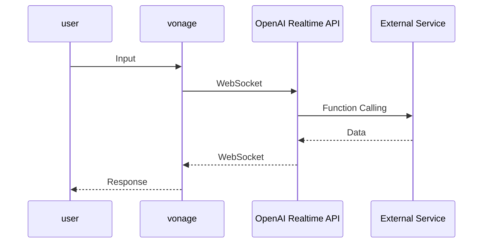

# Vonage と OpenAI Realtime API の WebSocket 連携

Vonage Voice API の音声ストリームを OpenAI Realtime API (GA / 2025-08-28 スキーマ) に中継し、
電話越しに音声対話ができるサーバーです。Function Calling による天気検索や通話転送にも対応しています。

## 概要


```mermaid
sequenceDiagram
    participant user
    participant vonage
    participant OpenAI Realtime API
    participant External Service

    user->>vonage: Input
    vonage->>OpenAI Realtime API: WebSocket
    OpenAI Realtime API->>External Service: Function Calling
    External Service-->>OpenAI Realtime API: Data
    OpenAI Realtime API-->>vonage: WebSocket
    vonage-->>user: Response
```

音声は Vonage が 16kHz、OpenAI Realtime API が 24kHz 固定のため、双方向でリサンプリングしています。

## ディレクトリ構成

```text
index.js                     エントリポイント (設定の読み込みとサーバー起動のみ)
src/
  config.js                  環境変数の集約と検証
  server.js                  Fastify の組み立て・ルート登録
  routes/
    health.js                / , /_/health , /_/metrics
    vonage-webhooks.js       /event , /answer (NCCO の生成)
    connect.js               /connect (アウトバウンド発信)
    media-stream.js          /media-stream (WebSocket)
  realtime/
    session.js               session.update ペイロードの生成
    bridge.js                Vonage ⇔ OpenAI の中継本体
  tools/
    index.js                 ツールレジストリ
    get-weather.js           get_weather
    put-name.js              put_name
    transfer-call.js         transfer_call
  vonage/
    jwt.js                   Voice API 用 JWT の生成
    calls.js                 発信 / 転送
  audio/
    resample.js              リサンプリングとフレーム分割
scripts/change-url.js        Vonage の Webhook URL を書き換える補助スクリプト
system-message.txt           システムプロンプト (最優先で読み込まれる)
```

### ツールを追加するには

`src/tools/` にモジュールを 1 つ足し、`definition` と `handler` を export したうえで
`src/tools/index.js` の `MODULES` に追加するだけです。OpenAI へ送るツール定義と
実行時の振り分けの両方に自動で反映されます。

## 必要な環境

- Node.js 22 以上
- Vonage アカウントと電話番号
- OpenAI の API キー

## 設定

### Vonage の準備

1. [Vonageアカウントの作成](https://zenn.dev/kwcplus/articles/create-vonage-account)
1. [Vonageで電話番号を取得する方法](https://zenn.dev/kwcplus/articles/buynumber-vonage)
1. [Vonage Voice API ガイド](https://zenn.dev/kwcplus/articles/vonage-voice-guide) に従ってアプリケーションを作成
1. 公開鍵と秘密鍵を生成し、秘密鍵を `private.key` という名前でディレクトリ直下に配置
1. 作成したアプリケーションに購入した電話番号をリンク

### OpenAI の API キー取得

<https://platform.openai.com/docs/quickstart>

### セットアップ

```sh
npm install
cp .env.example .env
```

`.env` を設定します。

キー | 必須 | 値
:--|:--|:--
`SERVER_URL` | ✅ | ngrok / Fly.io で払い出されたホスト名（`https://` は除く）。Vonage の WebSocket は `wss://` のみ対応のため `http://` は指定できません
`OPENAI_API_KEY` | ✅ | OpenAI のシークレットキー（`sk-` から始まる文字列）
`OPENAI_MODEL` | ✅ | Realtime 対応モデル。既定は `gpt-realtime`
`OPENAI_VOICE` | | 音声の種類。既定は `alloy`
`OPENAI_TRANSCRIPTION_MODEL` | | ユーザー発話の文字起こしモデル。既定は `gpt-4o-transcribe`
`VONAGE_APPLICATION_ID` | | Vonage アプリケーションの ID
`VONAGE_PRIVATE_KEY_PATH` | | 秘密鍵ファイルのパス（例: `./private.key`）
`VONAGE_PRIVATE_KEY` | | 秘密鍵そのもの。本番では Fly secrets 経由でこちらを使う
`VONAGE_OUTBOUND_FROM` | | 発信元電話番号（E.164形式）
`VONAGE_TRANSPORT_NUMBER` | | 転送先のデフォルト番号。`transfer_call` で指定がない場合に使用
`VONAGE_API_KEY` / `VONAGE_API_SECRET` | | `scripts/change-url.js` が Webhook URL を書き換える際に使用
`CONNECT_API_KEY` | | `/connect` の認証キー。未設定時は `VONAGE_APPLICATION_ID` にフォールバック
`OPEN_WEATHER_API_KEY` | | `get_weather` で使用する OpenWeatherMap の API キー
`LOG_LEVEL` | | ログレベル。既定は `info`

システムプロンプトはルートの `system-message.txt` が最優先で読み込まれます。
ファイルが存在しないか空の場合は既定の挨拶文を使用します。

### ローカルでの起動

```sh
npm start
ngrok http 3000
```

ngrok が払い出した URL（`https://` は除く）を `.env` の `SERVER_URL` に設定して再起動します。
ngrok を再起動するたびに URL が変わるため、その都度この手順を繰り返します。

Vonage ダッシュボードでアプリケーションの **回答 URL** に `<ngrok の URL>/answer`、
**イベント URL** に `<ngrok の URL>/event` を、いずれもメソッド `POST` で設定します。

`npm run debug` を使うと、`scripts/change-url.js` が `.env` の値をもとに
この Webhook URL の設定を自動で行ったうえでサーバーを起動します。

### テスト

アプリケーションにリンクした電話番号に電話をかけ、AI が応答することを確認します。

ユニットテストは以下で実行できます。

```sh
npm test
```

## `/connect` でのアウトバウンド発信

任意の番号へ発信するには `POST /connect` を呼び出します。
相手が応答すると `/answer` の NCCO（ガイダンス → WebSocket 接続）が実行されます。

```sh
curl -X POST https://<サーバー>/connect \
  -H "Content-Type: application/json" \
  -H "X-API-Key: ${CONNECT_API_KEY}" \
  -d '{
    "to": "+818012345678",
    "from": "+815012345678"
  }'
```

`from` を省略すると `VONAGE_OUTBOUND_FROM` の値が使われます。

`X-API-Key` ヘッダーは必須で、値が `CONNECT_API_KEY` と一致しないリクエストは拒否されます。
`CONNECT_API_KEY` を設定していない場合は後方互換のため `VONAGE_APPLICATION_ID` と比較しますが、
アプリケーション ID は秘密情報ではないため、専用の値を設定することを推奨します。

## Fly.io へのデプロイ

### Fly.io CLI のインストール

```sh
brew install flyctl
```

### 初期セットアップ（一度だけ）

本番用の環境変数を用意します。

```sh
cp .env .env.production
```

デプロイ環境を作成します。

```sh
fly launch
```

払い出されたサーバーの URL（`XXXXXXXX.fly.dev`）を `.env.production` の `SERVER_URL` に設定します。

環境変数を Fly.io に反映します。

```sh
fly secrets import < .env.production
```

秘密鍵はファイルではなく `VONAGE_PRIVATE_KEY` として渡します
（`npm run deploy` の中で `scripts/change-url.js` が自動的に設定します）。

### デプロイ

```sh
npm run deploy
```

`main` ブランチへの push でも GitHub Actions からデプロイされます（`.github/workflows/fly-deploy.yml`）。

## 実行環境の切り替え

`scripts/change-url.js` が Vonage 側の Webhook URL を書き換えるので、
以下のコマンドで環境を切り替えながらテストできます。

```sh
npm run debug    # ローカル (.env を使用)
npm run deploy   # Fly.io (.env.production を使用)
```
